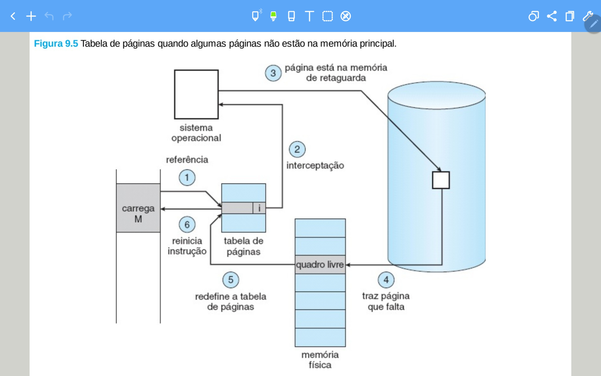

# Segunda prova

## Questão 1 - Explique oque são os problemas de Starvation, Priority Inversion e Deadlock

- **Starvation:** Situação em que um processo ou tarefa é ignorado ou negado recursos suficientes para sua execução. Isso pode ocorrer em sistemas com gerenciamento de processos baseado em prioridades, onde processos com prioridade mais baixa são frequentemente ignorados ou adiados em relação a processos com prioridade mais alta. Como resultado, esses processos com prioridade mais baixa podem ficar presos sem executar por longos períodos de tempo, o que é conhecido como starvation.

- **Deadlock:** Situação em que dois ou mais processos estão bloqueados permanentemente, aguardando mutuamente uns aos outros para liberar recursos. Isso pode ocorrer em sistemas que gerenciam recursos compartilhados, como processadores, memória, dispositivos de entrada/saída, etc.

- **Priority inversion:** O problema de inversão de prioridade ocorre em quando uma tarefa de menor prioridade impede ou adia a execução de tarefas de maior prioridade. Isso pode acontecer porque a tarefa de menor prioridade está usando recursos, como CPU, memória ou E/S, que são necessários para as tarefas de maior prioridade.

## Questão 2 - Tempo médio dos algoritmos de escalonamento da CPU

- **FCFS (First-come First-served):** Processos são executados por ordem de chegada.
- **SJF (Shortest-Job-First):** Processos são executados pela velocidade (os mais rápidos primeiro).
- **Priority:** Processos são executados na ordem da prioridade.

&emsp;&emsp; Para se calcular o tempo médio de cada algoritmo, em primeiro lugar, organize os processos na ordem de execução correta. Depois, calcule o tempo de espera de cada processo. Em seguida, some todos os tempos de espera e divida pela quantidade de processos. Por exemplo:

| Processo | Tempo para ser executado |
|--|--|
| 1 | 24 seg |
| 2 | 3 seg |
| 3 | 3 seg |

&emsp;&emsp; Supondo que essa será a ordem que os processos serão executados, o cálculo do tempo médio seria: 

1 - Tempo de espera: Te1 = 0, Te2 = 24, Te3 = 27 

2 - Média tempo de espera: (0 + 24 + 27)/3 = 17

## Questão 3 - Quais são os passos para o tratamento de um page fault

- Nessa questão ele deu a imagem a seguir, porém sem os passos e pediu para escrever o nome de cada um.

1 - Referência 

2 - Interceptação 

3 - Página está na memória de retaguarda 

4 - Traz página que falta 

5 - Redefine a tabela de páginas 

6 - Reinicia a instrução 

## Questão 4 - Não me lembro da questão, porém acredito que tenha sido algo relacionado à memória virtual